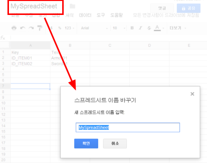
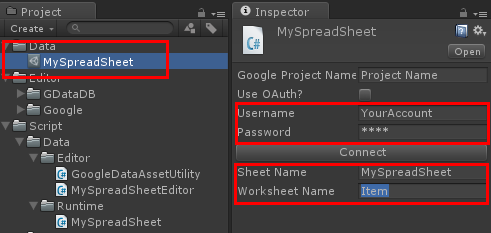

Unity-GoogleData
================

Unity-GoogleData enables to use google spreadsheet data within Unity editor. With Unity-GoogleData, you can retrieve data from google spreadsheet or upload any changed data back to google spreadsheet. 

Features
--------
* It can create an empty google spreadsheet.
* It can retrieve data from google spreadsheet.
* It can upload data back to google spreadsheet.
* No need to parse any retrieved data, it automatically serializes retrieved data to Unity3D's ScriptableObject.

Usage
-----

### Setting a Google Project

*NOTE*: It is no longer necessary to specify google project with GDataDB.

### Creating a Google SpreadSheet

This part of the document briefly shows how it works with the existing sample. If you need to know how to make your own class data for your googld spreadsheet, see the *Creating Your Own Unity3D ScriptableObject class* section.

First, you need to create a google spreadsheet on your Google Drive. Login your Google Drive with your google account and create a new spreadsheet.

Change the title of the created spreadsheet as *'MySpreadSheet'* like the following:

Next, create a new worksheet and rename it to whatever you want to as the following image shows:

Now, it needs to edit cells for spreadsheet. Insert *'Key'* and *'Text'* at the first row of the created worksheet as like that:

**IMPORTANT**  
Note that the first row should not contain any values which are used for your class members.

### Setting GoogleDataSetting Unity3D asset

Open Unity3D editor and select *MySpreadSheet* asset file on the project view. 

Next, you need to specify the google account and password then insert spreadsheet and worksheet name for *Sheet Name* and *Worksheet Name* text field. 

Then press *Connect* button and it shows the following if it is successfuly connected to the spreadsheet.

Now, press *Download* button and it will retrieve all data from the specified worksheet and properly reflects all the data on the Unity's Inspector view.

### Creating Your Own Unity3D ScriptableObject class

First, you need to define data class which represents google worksheet.

    [System.Serializable]
    public class MyData
    {
	    [ExposeProperty]
	    public string Key	{ get; set; }
	
	    [ExposeProperty]
	    public string Text	{ get; set; }	
    }

You need a ScriptableObject derived class which serializes data from google spreadsheet and to Unity Editor. It can be easily done with writing a BaseDatabase derived class.

	public class MySpreadSheet : BaseDatabase 
	{
		public MyData[] dataArray = new MyData[0];
		
		void OnEnable()
		{
	#if UNITY_EDITOR
			//hideFlags = HideFlags.DontSave;
	#endif
		}
		
		public MyData FindByKey(string key)
		{
			return Array.Find(dataArray, d => d.Key == key);
		}
	}

You also need to write editor script. It needs to override three member functions: *OnEnable*, *OnInspectorGUI* and *Load* are that.

	using UnityEngine;
	using UnityEditor;
	using System.Collections;
	using System.Collections.Generic;
	using System.Text;

	using GDataDB;
	using GDataDB.Linq;

	[CustomEditor(typeof(MySpreadSheet))]
	public class MySpreadSheetEditor  : BaseEditor<MySpreadSheet>
	{
		
		public override void OnEnable()
		{
			base.OnEnable();
			
			MySpreadSheet data = database as MySpreadSheet;
			
			databaseFields = ExposeProperties.GetProperties(data);
			
			foreach(MyData e in data.dataArray)
			{
			    dataFields = ExposeProperties.GetProperties(e);
				pInfoList.Add(dataFields);
			}
		}
		

Within *OnInspectorGUI*, all data which are retrieved are properly drawn on the inspector view of Unity Editor.

		public override void OnInspectorGUI()
		{
			base.OnInspectorGUI();
			
			//DrawDefaultInspector();
			if (GUI.changed)
			{
				pInfoList.Clear();
				
				MySpreadSheet data = database as MySpreadSheet;
				foreach(MyData e in data.dataArray)
				{
					dataFields = ExposeProperties.GetProperties(e);
					pInfoList.Add(dataFields);
				}
				
				EditorUtility.SetDirty(target);
				Repaint();
			}
		}
		

When you press *Download* button, overrided *Load* member function is call. So it's the place actually creates a database object and retrieves all data from google's spreadsheet.

		public override bool Load()
		{
			var client = new DatabaseClient(username, password);		
			var db = client.GetDatabase(database.SheetName) ?? client.CreateDatabase(database.SheetName);	
			var table = db.GetTable<MyData>(database.WorksheetName) ?? db.CreateTable<MyData>(database.WorksheetName);
			
			List<MyData> myDataList = new List<MyData>();
			
			var all = table.FindAll();						
			foreach(var elem in all)
			{
				MyData data = new MyData();
				
				data = Cloner.DeepCopy<MyData>(elem.Element);
				myDataList.Add(data);
			}
						
			MySpreadSheet mySpreadSheet = (MySpreadSheet)base.database;
			mySpreadSheet.dataArray = myDataList.ToArray();
			
			EditorUtility.SetDirty(mySpreadSheet);
			AssetDatabase.SaveAssets();
			
			return true;
		}
	}

Last, write an editor script which makes a menu item for creating newly defined scriptable object.

	public static class GoogleDataAssetUtility
	{
		[MenuItem("Assets/Create/GoogleData/MySpreadSheet")]
		public static void CreateGoogleDataTestSphreadSheetAsset()
		{
			CustomAssetUtility.CreateAsset<MySpreadSheet>();
		}
		
	}

Limitation
----------

References
----------
* [GDataDB](https://github.com/mausch/GDataDB) is used to retrieve data from Google Spreadsheet. Note that [GDataDB](https://github.com/mausch/GDataDB) is slightly modified to support *enum* type.
* [ExposeProperties](http://wiki.unity3d.com/index.php/Expose_properties_in_inspector) is used to easily expose variables of spreadsheet on the Unity3D's inspector view and let [GDataDB](https://github.com/mausch/GDataDB) access through get/set accessors.

License
-------

This code is distributed under the terms and conditions of the MIT license.

Copyright (c) 2013 Kim, Hyoun Woo